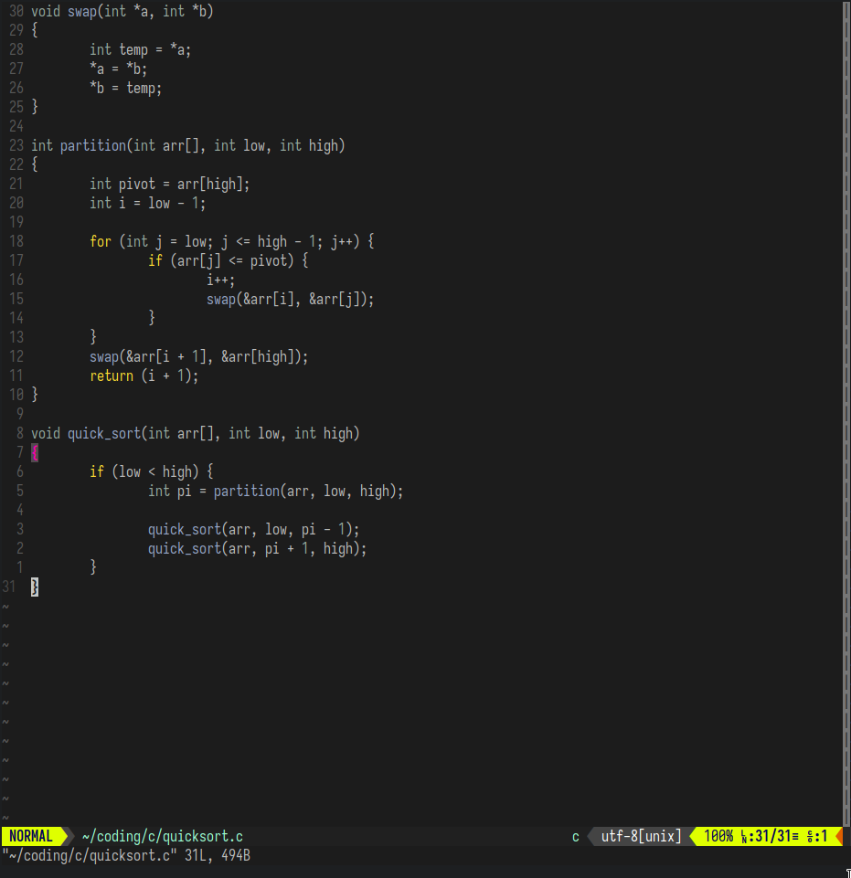

# gruber-darker.nvim

> [!WARNING]
> This Neovim theme is incomplete. Keep your expectations realistic.

This is a port of [Alexey Kutepov's extension](https://github.com/rexim/gruber-darker-theme) of the Gruber Darker theme to Neovim.

## Installation

lazy.nvim:
```lua
{
    "walker84837/gruber-darker.nvim",
    lazy = false,
    priority = 1000,
    config = function() -- Use this if you plan on using this theme every time
        vim.cmd('colorscheme gruber-darker')
    end,
}
```

## Contributing

Contributions are welcome\!

If you'd like to contact me, you can message me via Matrix at
`@winlogon.exe:matrix.org` or via [Telegram](https://t.me/winlogon3).

## Preview



## License

This theme is licensed under the [MIT licence](LICENSE.md).
